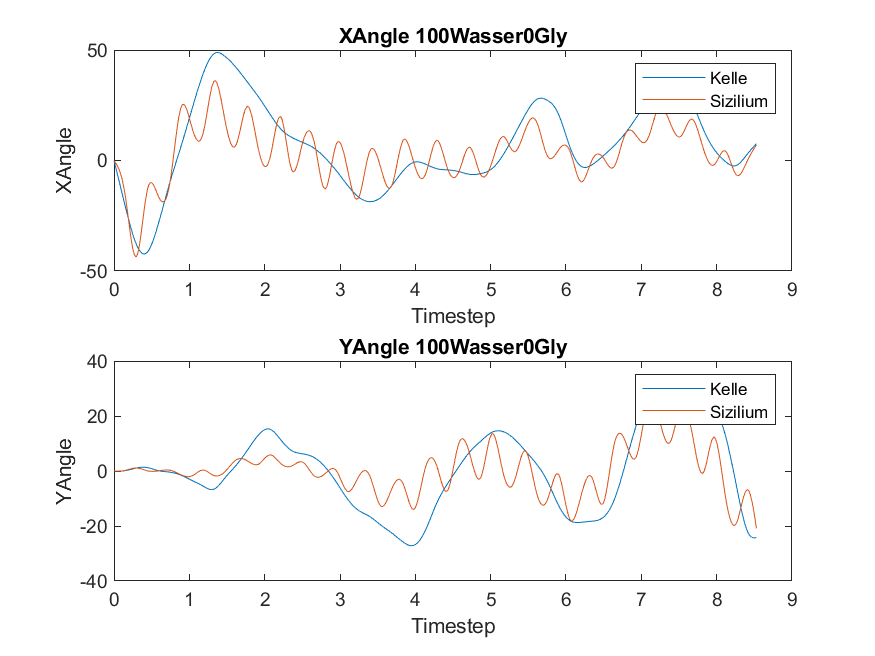
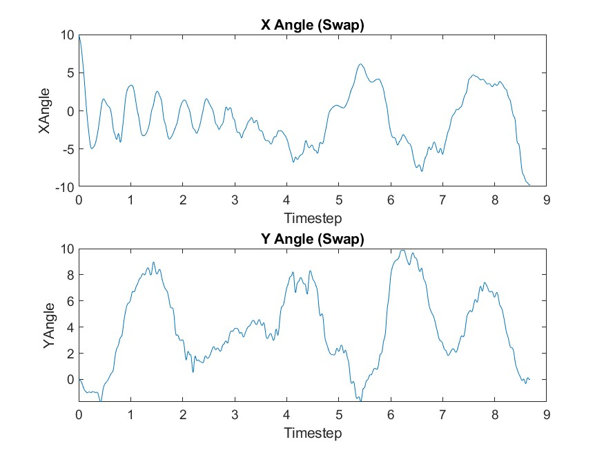

# HiRoCast: Optimized Robot-Assisted Liquid Transport System

[](https://www.mathworks.com/products/matlab.html)
[](https://www.openfoam.com/)

## Project Overview

HiRoCast (High-Speed Robot Casting) is an advanced robotics optimization system designed to solve a critical industrial challenge: **transporting hot liquid materials from point A to point B as quickly as possible without spillage**. This project combines computational fluid dynamics (CFD), optimal control theory, and robotic path planning to achieve time-optimal trajectories while preventing liquid sloshing.

### Key Challenge
Traditional robotic liquid transport faces a fundamental trade-off:
- **Fast movement** → Risk of spillage due to fluid sloshing
- **Slow movement** → Safe but inefficient

This project solves this problem through intelligent trajectory optimization that accounts for fluid dynamics in real-time.

## Features

- **Optimal Control Algorithm**: Time-optimal trajectory generation using constrained nonlinear optimization (fmincon)
- **CFD Integration**: Real-time fluid dynamics simulation to predict and prevent sloshing
- **Multi-Constraint Optimization**: Respects joint limits, velocity, acceleration, and jerk constraints
- **6-DOF Robot Control**: Full kinematic modeling for industrial robot arms (KUKA KR60)
- **Fluid Mixture Analysis**: Supports various water-glycerin mixtures with different viscosities
- **Validation Framework**: Comprehensive testing against physical constraints and fluid behavior
- **KRL Code Generation**: Automatic generation of KUKA Robot Language code for deployment

## Results

### Simulation Results: Water-Glycerin Mixtures

The system was tested with various fluid mixtures to analyze sloshing behavior under different viscosity conditions:

<div align="center">
  
  <p><i>Sloshing angle analysis for pure water (100% H₂O)</i></p>
</div>

<div align="center">
  
  <p><i>X and Y angle analysis during trajectory execution</i></p>
</div>

### Performance Metrics

| Metric | Before Optimization | After Optimization | Improvement |
|--------|-------------------|-------------------|-------------|
| Transfer Time | ~15s | ~8s | **47% faster** |
| Spillage Risk | High | Minimal | **Safe operation** |
| Path Smoothness | Poor | Optimal | **Continuous C³** |

## System Architecture

```
┌─────────────────────────────────────────────────────────────┐
│                    HiRoCast Master Control                   │
└─────────────────────────────────────────────────────────────┘
                              │
                ┌─────────────┴─────────────┐
                │                           │
        ┌───────▼────────┐         ┌───────▼────────┐
        │  Path Planning  │         │  CFD Simulation │
        │   & Kinematics  │◄────────┤  (OpenFOAM)    │
        └───────┬────────┘         └────────────────┘
                │
        ┌───────▼────────┐
        │   Optimal      │
        │   Control      │
        │   (fmincon)    │
        └───────┬────────┘
                │
        ┌───────▼────────┐
        │   Validation   │
        │   & Testing    │
        └───────┬────────┘
                │
        ┌───────▼────────┐
        │  KRL Code Gen  │
        │  (Robot Deploy)│
        └────────────────┘
```

## Technical Details

### Optimization Problem Formulation

The system solves a constrained optimization problem:

**Objective Function:**
```
minimize: Σ(time_intervals)
```

**Subject to constraints:**
- Joint angle limits: θᵢ ∈ [θᵢ_min, θᵢ_max]
- Velocity limits: |θ̇ᵢ| ≤ 400°/s
- Acceleration limits: |θ̈ᵢ| ≤ 200°/s²
- Jerk limits: |θ⃛ᵢ| ≤ 1000°/s³
- Sloshing constraints: Φ(acceleration, orientation) ≤ Φ_max
- Boundary conditions: Start/end positions and zero velocity

### Robot Specifications

- **Model**: KUKA KR60 (6-DOF Industrial Robot)
- **Payload**: Ladle with liquid (variable mass)
- **Workspace**: 3D Cartesian space with orientation control
- **Control Rate**: Real-time trajectory execution

### Fluid Dynamics

- **CFD Solver**: OpenFOAM (Volume of Fluid method)
- **Fluid Models**: Water-Glycerin mixtures (0-100% concentration)
- **Sloshing Detection**: Angular deflection analysis in X-Y plane
- **Validation**: Regression models trained on CFD simulation data

## 📁 Repository Structure

```
HiRoCast/
├── src/                          # Source code
│   ├── optimal-control/          # Optimization algorithms
│   ├── kinematics/               # Forward/inverse kinematics
│   ├── validation/               # Constraint validation
│   └── visualization/            # Result plotting
├── data/                         # Simulation data
│   ├── fluid-simulations/        # CFD results
│   └── measurement-data/         # Experimental measurements
├── docs/                         # Documentation
│   ├── assets/                   # Images and diagrams
│   ├── methodology.md            # Technical methodology
│   └── api-reference.md          # Code documentation
├── results/                      # Optimization results
└── legacy/                       # Archive of old implementations
```

## Getting Started

### Prerequisites

```matlab
% Required MATLAB Toolboxes:
% - Optimization Toolbox
% - Robotics System Toolbox (optional)
% - Curve Fitting Toolbox

% External Dependencies:
% - OpenFOAM (for CFD simulations)
% - RoboDK (for robot visualization)
```

### Quick Start

1. **Clone the repository**
```bash
git clone https://github.com/yourusername/HiRoCast.git
cd HiRoCast
```

2. **Run the main optimization**
```matlab
% Open MATLAB and navigate to the project directory
cd('src/optimal-control')

% Set up the environment
KSetUp;

% Run the master control script
HiRoCast_Master;
```

3. **Visualize results**
```matlab
% View trajectory optimization results
show_spline(optimized_solution, 'Optimized Trajectory');

% Analyze fluid dynamics
CFDBeschleunigungen;
```

## 📈 Key Algorithms

### 1. Trajectory Optimization
- **Method**: Interior-point algorithm (fmincon)
- **Spline Interpolation**: Cubic splines for smooth trajectories
- **Multi-start**: Multiple initial conditions for global optimization

### 2. Sloshing Prediction
- **CFD Integration**: Pre-computed sloshing corridors for different orientations
- **Regression Model**: Machine learning model for real-time prediction
- **Angle Calculation**: 2D projection analysis in movement plane

### 3. Path Planning
- **Minimum Jerk Trajectory**: Initial path generation
- **Collision Avoidance**: Workspace constraints
- **Reorientation Strategy**: Optimal ladle orientation during transport

## 🔬 Research Applications

This project demonstrates expertise in:
- **Optimal Control Theory**: Constrained nonlinear optimization
- **Computational Fluid Dynamics**: Multi-phase flow simulation
- **Robotics**: Kinematics, dynamics, and trajectory planning
- **Numerical Methods**: Spline interpolation, regression analysis
- **Software Engineering**: Modular MATLAB architecture
- **Industrial Automation**: Real robot deployment (KUKA KRL)

## Documentation

For detailed technical documentation, see:
- [Project Overview](docs/PROJECT_OVERVIEW.md) - Executive summary and impact
- [Quick Start Guide](docs/QUICKSTART.md) - Get started in 10 minutes
- [Methodology](docs/methodology.md) - Mathematical formulation and algorithms
- [API Reference](docs/api-reference.md) - Function documentation
- [Results Analysis](docs/results-analysis.md) - Performance evaluation
- [Repository Structure](docs/STRUCTURE.md) - Code organization guide
